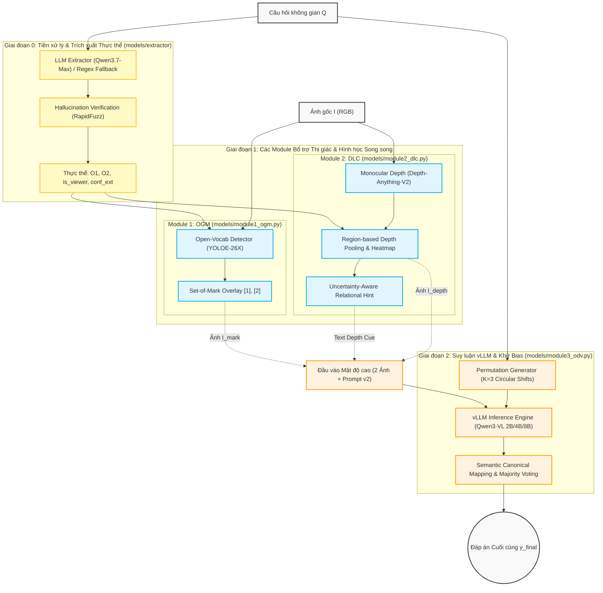

# ASTRA: Phương pháp luận & Kiến trúc hệ thống

Tài liệu này mô tả chi tiết nền tảng lý thuyết, công thức toán học, cấu trúc xử lý dữ liệu và cơ chế hoạt động của các module lõi trong khung suy luận **ASTRA** (*Auxiliary Spatial Tools for Robust Answering*). Khác với các cách tiếp cận truyền thống dựa trên tinh chỉnh mô hình tốn kém (Supervised Fine-Tuning / Reinforcement Learning), ASTRA hoạt động hoàn toàn ở pha **Inference (Zero-shot)**. Hệ thống giải quyết hai nguyên nhân gốc rễ gây ra lỗi suy luận không gian trên các Mô hình Ngôn ngữ - Thị giác lớn (MLLMs): (1) sự mơ hồ trong nhận thức thị giác và định vị chiều sâu, và (2) thiên lệch vị trí từ khóa khi giải mã trắc nghiệm (*Blind Spatial Token Favouring* - BSTF).

---

## 1. Định nghĩa Bài toán & Cấu trúc Dữ liệu (Preliminaries & Problem Formulation)

Bài toán suy luận quan hệ không gian trực quan trắc nghiệm (*Visual Spatial Relation Multiple-Choice Question Answering*) được định nghĩa dựa trên cấu trúc tập dữ liệu chuẩn **SpatialMQA** (được thể hiện trong tập dữ liệu mẫu `test.jsonl`). 

Với mỗi mẫu kiểm thử thứ $i \in \{0, 1, \dots, N-1\}$, hệ thống nhận một bộ dữ liệu đầu vào $\mathcal{D}_i = (I_i, Q_i, \mathcal{O}_i)$, trong đó:
- **Ảnh trực quan ($I_i \in \mathbb{R}^{H \times W \times 3}$):** Một bức ảnh 2D RGB thực tế của cảnh vật (phòng khách, bãi biển, đường phố...) chứa các đối tượng vật lý nằm trong không gian 3D bị nén trên mặt phẳng 2D.
- **Câu hỏi ngôn ngữ tự nhiên ($Q_i$):** Một truy vấn bằng văn bản tiếng Anh hỏi về quan hệ hình học tương đối giữa một thực thể mục tiêu và một mốc tham chiếu (ví dụ: *"Where is the kettle located relative to the microwave?"* hoặc câu hỏi thay đổi góc nhìn *"If you were a person walking on the beach, on which side of you would the water be?"*).
- **Tập phương án trả lời ($\mathcal{O}_i = \{o_1, o_2, \dots, o_M\}$):** Danh sách các ứng viên quan hệ không gian rời rạc với $M \ge 2$. Trong bộ dữ liệu SpatialMQA, tập phương án thường thuộc các nhóm từ vựng định hướng:
  $$\mathcal{O}_i \subseteq \big\{\text{"left of"}, \text{"right of"}, \text{"in front of"}, \text{"behind"}, \text{"on/above"}, \text{"below"}\big\}$$
- **Nhãn đúng ($y_i^* \in \mathcal{O}_i$):** Đáp án chuẩn (ground-truth) do con người gán nhãn.

**Mục tiêu của ASTRA:**
Với mô hình Ngôn ngữ - Thị giác lớn (MLLM) cốt lõi $\mathcal{M}_\theta$ được giữ **hoàn toàn đóng băng tham số (frozen weights)**, mục tiêu của khung suy luận ASTRA là ánh xạ bộ ba đầu vào $(I_i, Q_i, \mathcal{O}_i)$ thành quyết định dự đoán cuối cùng $\hat{y}_i \in \mathcal{O}_i$ sao cho tối đa hóa độ chính xác tổng thể:
$$\max \frac{1}{N} \sum_{i=0}^{N-1} \mathbb{I}\left(\hat{y}_i == y_i^*\right)$$
Đồng thời, hệ thống phải đảm bảo **tính bất biến với thứ tự phương án (Order-Invariance)**, tức là dự đoán $\hat{y}_i$ không bị thay đổi khi các phần tử trong tập ứng viên $\mathcal{O}_i$ bị hoán vị thứ tự hiển thị (khử lỗi Blind Spatial Token Favouring).

---

## 2. Kiến trúc Tổng thể (Pipeline Overview)

Quy trình xử lý một câu hỏi không gian trong ASTRA được chia thành 3 giai đoạn chính: **Tiền xử lý & Trích xuất thực thể (Extractor)**, **Tạo manh mối bổ trợ song song (OGM & DLC)**, và **Khử thiên lệch giải mã bằng bỏ phiếu (ODV)**.



---

## 3. Tiền xử lý & Trích xuất Thực thể (Entity Extraction Pipeline)

*(Triển khai tại `models/extractor/` và `scripts/extract_objects.py`)*

Trước khi tác động vào hình ảnh, ASTRA cần phân tách câu hỏi ngôn ngữ tự nhiên $Q$ thành các mục tiêu nhận thức rõ ràng. Hệ thống sử dụng kiến trúc lai giữa **LLM Extractor** (chính) và **Regex Legacy** (dự phòng/cắt lớp ablation).

### 2.1. Trích xuất bằng LLM (Qwen3.7-Max via DashScope)

Hệ thống sử dụng mô hình **Qwen3.7-Max** thông qua OpenAI-compatible API (`llm_client.py`) với kỹ thuật **Few-shot Prompting** (8 ví dụ chuẩn hóa từ tập `train/dev.jsonl`). Đầu ra được định dạng theo JSON Schema nghiêm ngặt với 4 trường thông tin:

$$
\mathcal{E}(Q) = \{O_1, O_2, \text{is\_viewer}, c_{\text{ext}}\}
$$

- **$O_1$ (Subject Object):** Thực thể mục tiêu cần xác định vị trí không gian.
- **$O_2$ (Reference Object):** Thực thể mốc tham chiếu. Nếu câu hỏi không có mốc vật lý mà tham chiếu theo quan sát viên (ví dụ: *"from your perspective"*, *"to your left"*), $O_2$ được gán bằng thực thể mô tả (hoặc `null`).
- **$\text{is\_viewer} \in \{\text{True}, \text{False}\}$:** Biến cờ xác định $O_2$ có phải là góc nhìn của người quan sát (mặt phẳng camera) hay không.
- **$c_{\text{ext}} \in [0, 1]$:** Độ tin cậy tự đánh giá (self-reported confidence) của LLM đối với kết quả trích xuất.

### 2.2. Kiểm chứng Ảo giác (Hallucination Verification)

Để ngăn chặn việc LLM tự bịa đặt thực thể không có trong câu hỏi, mô-đun `verify.py` thực hiện kiểm tra chéo (sanity check):

1. **Chuẩn hóa từ vựng:** Loại bỏ mạo từ và đại từ sở hữu ($\{\text{the, a, an, it, you, your, i}\}$).
2. **Đối khớp chính xác & Mờ (Fuzzy Matching):** Kiểm tra sự xuất hiện trực tiếp của các token trong $Q$. Nếu không khớp hoàn toàn, thuật toán **RapidFuzz** được kích hoạt để tính tỷ lệ khớp chuỗi con (partial ratio):
   $$
   \text{Match}(t, Q) = \begin{cases} \text{True} & \text{nếu } t \in Q \text{ hoặc } \text{partial\_ratio}(t, Q) \ge 75\% \\ \text{False} & \text{ngược lại} \end{cases}
   $$
3. **Cổng kiểm soát độ tin cậy (Confidence Gating):** Nếu phát hiện $O_1$ hoặc $O_2$ bị ảo giác ($\text{hallucinated} = \text{True}$), độ tin cậy bị ép buộc về $c_{\text{ext}} = 0.0$. Hệ thống áp dụng ngưỡng kiểm soát $\tau_{\text{ext}} = 0.6$:
   $$
   \text{Valid}(\mathcal{E}) = \mathbb{I}\left(c_{\text{ext}} \ge 0.6 \;\land\; \neg \text{hallucinated}(O_1) \;\land\; \neg \text{hallucinated}(O_2)\right)
   $$

   Nếu $\text{Valid}(\mathcal{E}) = 0$, hệ thống tự động kích hoạt **Regex Fallback** (bao phủ 7 biểu thức mẫu cú pháp câu hỏi không gian truyền thống) để đảm bảo tính bao phủ 100% mẫu dữ liệu.

---

## 4. Module 1 — Object-Grounded Marking (OGM)

*(Triển khai tại `models/module1_ogm.py` và `scripts/step1_bbox_images.py`)*

### 3.1. Phát hiện Từ vựng Mở với YOLOE-26X

Để khắc phục hiện tượng trôi sự chú ý (attention drift) của VLM trong các ngữ cảnh phức tạp, ASTRA tạo ra các "điểm neo trực quan" (visual anchors). Với ảnh đầu vào $I \in \mathbb{R}^{H \times W \times 3}$ và chuỗi thực thể $O_1, O_2$, hệ thống gọi mô hình **YOLOE-26X** (Open-Vocabulary Object Detector):

$$
\mathcal{B} = \text{YOLOE}(I, \{O_1, O_2\})
$$

Mỗi nhận diện trả về tọa độ chuẩn hóa $[x_1, y_1, x_2, y_2] \in [0, 1]^4$ và điểm số nhận diện $s \in [0, 1]$. Điểm neo được chấp nhận nếu vượt qua ngưỡng tin cậy nhận diện $\tau_{\text{det}} = 0.3$:

$$
\text{marks\_ok} = \left(s(O_1) \ge \tau_{\text{det}}\right) \land \left(\text{is\_viewer} \lor s(O_2) \ge \tau_{\text{det}}\right)
$$

### 3.2. Đánh dấu Set-of-Mark (SoM) Trực quan

Khi $\text{marks\_ok} = \text{True}$, ASTRA sinh ra ảnh đã đánh dấu $I_{\text{mark}}$ theo quy tắc thiết kế không xâm lấn (non-occlusive overlay):

1. **Khung viền (Bounding Box):** Vẽ viền độ dày 3px bao quanh đối tượng. Màu đỏ (`#FF0000`) dành cho $O_1$ và màu xanh dương (`#0080FF`) dành cho $O_2$.
2. **Nhãn đặt ngoài (Outside Labeling):** Nhãn trực quan `[1]` và `[2]` được đặt tại vị trí góc trên-trái phía ngoài hộp viền $\left(x_1 - w_{\text{lbl}}, y_1 - h_{\text{lbl}}\right)$ nhằm tránh che khuất các chi tiết nội dung bên trong vật thể.
3. **Kích thước Font thích ứng:** Kích thước chữ được tinh chỉnh động theo tỷ lệ phân giải ảnh gốc:
   $$
   f_{\text{size}} = \text{clip}\left(\min(W, H) \times 0.028, \; 14, \; 48\right)
   $$
4. **Cơ chế Fallback Tối ưu:** Nếu nhận diện thất bại ($\text{marks\_ok} = \text{False}$), module trả về nguyên bản ảnh gốc $I_{\text{mark}} \equiv I$ và tắt các nhãn đánh dấu trong prompt. Điều này ngăn chặn triệt để việc VLM bị nhiễu loạn do các hộp viền bị vẽ sai vị trí (error cascading prevention).

---

## 5. Module 2 — Depth-Layer Cue (DLC)

*(Triển khai tại `models/module2_dlc.py` và `scripts/step2_depth_images.py`)*

Ảnh 2D truyền thống bị mất thông tin chiều sâu $Z$, khiến VLM thường xuyên phán đoán sai các quan hệ như *"in front of"*, *"behind"*, hoặc *"closer to you"*. Module DLC giải quyết vấn đề này bằng cách kết hợp bản đồ nhiệt trực quan và gợi ý ngôn ngữ định lượng.

### 4.1. Ước lượng Chiều sâu Đơn ảnh (Monocular Depth Estimation)

ASTRA sử dụng mạng **Depth-Anything-V2** (encoder ViT-L, cấu hình Small/Base/Large) để trích xuất bản đồ chiều sâu liên tục. Ảnh $I$ được chuẩn hóa về độ phân giải $518 \times 518$, đưa qua mạng dự đoán và nội suy ngược về kích thước gốc $(H, W)$.

Bản đồ độ sâu thô $D_{\text{raw}}$ được chuẩn hóa min-max về đoạn $[0, 1]$ và **đảo ngược quy ước** (invert) sao cho giá trị càng nhỏ tương ứng với vị trí càng gần camera:

$$
D(x, y) = 1.0 - \frac{D_{\text{raw}}(x, y) - \min(D_{\text{raw}})}{\max(D_{\text{raw}}) - \min(D_{\text{raw}})}, \quad \forall (x, y) \in [0, W] \times [0, H]
$$

### 4.2. Gộp miền theo Hộp viền (Region-based Depth Pooling)

Với tọa độ hộp viền $B_i = [x_1^{(i)}, y_1^{(i)}, x_2^{(i)}, y_2^{(i)}]$ của thực thể $O_i$ nhận được từ Module 1, hệ thống tính toán giá trị chiều sâu đại diện $\bar{D}(O_i)$ thông qua phép lấy trung bình miền (mean pooling):

$$
\bar{D}(O_i) = \frac{1}{|B_i|} \sum_{(x, y) \in B_i} D(x, y)
$$

*Lưu ý đặc biệt cho góc nhìn quan sát viên:* Nếu $\text{is\_viewer} = \text{True}$, thực thể $O_2$ đại diện cho mặt phẳng camera, do đó chiều sâu được gán tuyệt đối: $\bar{D}(O_2) = 0.0$.

### 4.3. Sinh Ảnh Bản đồ nhiệt & Gợi ý Ngôn ngữ Mềm (Uncertainty-Aware Hint)

DLC cung cấp cho VLM hai luồng thông tin bổ trợ song song:

1. **Bản đồ nhiệt Thị giác ($I_{\text{depth}}$):** Bản đồ $D(x, y)$ được ánh xạ qua bảng màu **Viridis** (hoặc Turbo), gắn thêm thanh chú giải Colorbar Legend ("Near $\rightarrow$ Far") ở góc dưới-phải và in trực tiếp nhãn số trị độ sâu lên các hộp viền `[1]≈0.XX`, `[2]≈0.YY`.
2. **Gợi ý Ngôn ngữ Mềm (Soft Textual Hint):** Để tránh việc VLM nhắm mắt tin theo mô hình chiều sâu (ốn có thể sai số trên các cảnh phẳng hoặc quá xa), ASTRA sinh lời nhắc dưới dạng thông tin tham khảo có tính uncertainty:
   $$
   \Delta D = \bar{D}(O_2) - \bar{D}(O_1)
   $$

   - **Trường hợp tương đương ($|\Delta D| < \epsilon_{\text{depth}}$, với $\epsilon_{\text{depth}} = 0.05$):**
     *"Depth hint (auxiliary, may be inaccurate): objects [1] and [2] appear to be at a similar depth. This estimate may be unreliable for flat or distant scenes — verify visually."*
   - **Trường hợp chênh lệch ($|\Delta D| \ge \epsilon_{\text{depth}}$):**
     *"Depth hint (auxiliary, may be inaccurate): object [1] appears closer to the camera than object [2] based on an external depth model. Please cross-check this against what you directly observe in the image before concluding — do not rely on this hint alone."*

---

## 6. Module 3 — Order-Debiased Voting (ODV) & vLLM Batched Inference

*(Triển khai tại `models/module3_odv.py`, `models/prompt_v2.py`, và `scripts/step3_vlm_inference.py`)*

### 5.1. Khảo sát hiện tượng Blind Spatial Token Favouring (BSTF)

Trong các bài toán trắc nghiệm không gian, các MLLM thường thể hiện sự thiên lệch vị trí giải mã nặng nề (ví dụ: xác suất chọn đáp án `(A)` hoặc `(B)` cao bất thường bất kể nội dung ngữ nghĩa). Chúng tôi gọi hiện tượng này là **BSTF**. Để triệt tiêu bias này mà không cần cập nhật trọng số, ODV sử dụng chiến lược hoán vị đáp án và bỏ phiếu đồng thuận.

### 5.2. Thuật toán Hoán vị Dịch vòng (Circular Shift Permutations)

Cho tập hợp các phương án trả lời ban đầu $\mathcal{O} = \{o_0, o_1, \dots, o_{N-1}\}$, hệ thống tạo ra $K = \min(3, N)$ phiên bản hoán vị dịch vòng:

$$
\mathcal{O}^{(k)} = \text{CircularShift}(\mathcal{O}, k) = \left\{o_{(i+k) \bmod N}\right\}_{i=0}^{N-1}, \quad k \in \{0, 1, \dots, K-1\}
$$

Ví dụ với $\mathcal{O} = \{\text{left of}, \text{right of}, \text{behind}\}$:

- $k=0 \to \text{(A) left of } | \text{ (B) right of } | \text{ (C) behind}$
- $k=1 \to \text{(A) right of } | \text{ (B) behind } | \text{ (C) left of}$
- $k=2 \to \text{(A) behind } | \text{ (B) left of } | \text{ (C) right of}$

### 5.3. Cấu trúc Prompt Mật độ cao (Prompt v2 Template)

Hệ thống kết hợp cả 2 hình ảnh ($I_{\text{mark}}$ và $I_{\text{depth}}$) cùng toàn bộ tri thức định lượng vào một cấu trúc prompt duy nhất (`_PROMPT_FULL` trong `prompt_v2.py`):

```text
You are given 2 images of the same scene:
- Image 1: the photo with two reference points marked — [1] = {o1_name}{opt_o2_mark}.
- Image 2: an auxiliary depth heatmap of the same scene, where brighter/warmer colors = closer to the camera and darker/cooler colors = farther. A colorbar legend (Near -> Far) is shown in the bottom-right corner...

  Estimated relative depth (lower = closer to camera): [1]≈{depth_o1:.2f}{opt_o2_depth}
  {viewer_note}
  Depth hint: {depth_relation}

Question: {question}

Options:
{options_block_permuted}

Think briefly, then answer in exactly this format:
Answer: (X)
```

**Xử lý chuyên biệt cho góc nhìn Quan sát viên (`O2_is_viewer = True`):**
Khi câu hỏi mang tính chất perspective-taking (tham chiếu theo góc nhìn camera thay vì vật thể vật lý), hệ thống tự động điều chỉnh prompt để tránh gây ảo giác cho VLM:
1. **Ẩn nhãn `[2]` trên ảnh 1:** Tham số `{opt_o2_mark}` và `{opt_o2_depth}` được gán rỗng (chỉ hiển thị mốc `[1]`).
2. **Tiêm ghi chú góc nhìn (`{viewer_note}`):** Hệ thống tự động chèn câu thông báo chuyên biệt vào thẳng prompt:
   > *"Note: {o2_name} refers to your own viewpoint (the camera position), which is not a physical object and is therefore not marked in the images. Its reference depth is defined as 0 (the camera plane)."*

### 5.4. Động cơ Suy luận Tốc độ cao vLLM (Batched Engine)

Để giải quyết chi phí tính toán khi phải suy luận $K$ lần cho mỗi mẫu, ASTRA triển khai động cơ **vLLM** (`VLMInferenceEngine`) thay thế cho HuggingFace Transformers tuần tự:

- **Batched Request Processing:** Tất cả $K$ hoán vị của các câu hỏi được đóng gói thành các lô lớn (batches), khai thác tối đa băng thông bộ nhớ GPU nhờ công nghệ **PagedAttention**.
- **Hỗ trợ Đa quy mô:** Tương thích hoàn toàn với các dòng open-weight **Qwen3-VL** (2B, 4B, 8B) với khả năng phân tán ten-xơ (`tensor_parallel_size`).
- **Tối ưu Tokens:** Giới hạn `max_new_tokens = 128` cùng tham số `do_sample = False` (Greedy Decoding), đảm bảo tính xác định (determinism) tuyệt đối cho nghiên cứu khoa học.

### 5.5. Ánh xạ Ngữ nghĩa & Bỏ phiếu Đa số (Majority Voting)

với mỗi hoán vị $k$, VLM sinh ra chuỗi văn bản đầu ra. Hàm `parse_answer_from_output` trích xuất ký tự phương án $\hat{y}^{(k)} \in \{\text{A, B, C, D}\}$ (bằng regex hoặc từ khóa không gian normalized) và ánh xạ ngược về nội dung ngữ nghĩa gốc:

$$
c^{(k)} = \text{MapToCanonical}\left(\hat{y}^{(k)}, \; \mathcal{O}^{(k)}, \; \mathcal{O}\right) \in \mathcal{O}
$$

Thuật toán Bỏ phiếu Đa số (Majority Voting) tổng hợp $K$ kết quả để chọn ra đáp án cuối cùng $y_{\text{final}}$ có sự đồng thuận cao nhất:

$$
y_{\text{final}} = \arg\max_{c \in \mathcal{O}} \sum_{k=0}^{K-1} \mathbb{I}\left(c^{(k)} == c\right)
$$

Nếu có sự đồng hạng (tie), hệ thống ưu tiên đáp án của hoán vị gốc ($k=0$). Cơ chế này đảm bảo rằng một đáp án chỉ chiến thắng khi nó được mô hình kiên định lựa chọn dựa trên hình học thị giác, bất kể nó bị dịch chuyển sang nhãn (A), (B) hay (C), khử hoàn toàn sai số do BSTF.

---

## 7. Tóm tắt Chi phí - Hiệu quả & Chiến lược leo thang (Adaptive Escalation)

Khung suy luận ASTRA mang lại sự linh hoạt tối đa nhờ thiết kế mô-đun tháo lắp (plug-and-play). Khi triển khai thực tế, hệ thống hỗ trợ chiến lược **Adaptive Escalation** nhằm cân bằng giữa hiệu năng suy luận và chi phí tính toán:

1. **Bước 1 (Base Zero-Shot):** Mô hình VLM đánh giá câu hỏi ban đầu với $K=1$.
2. **Bước 2 (Gating Kích hoạt):** Nếu câu hỏi thuộc nhóm có độ mờ nhịt cao về vị trí (phát hiện từ vựng không gian như *"relative to"*, *"in front of"*) hoặc khi kiểm tra nhanh $K=2$ hoán vị xảy ra bất đồng ý kiến ($\text{disagreement}$), hệ thống mới kích hoạt toàn bộ luồng OGM + DLC + ODV ($K=3$).
3. **Hiệu quả:** Nhờ vLLM batching và cơ chế fallback thông minh tại từng module, ASTRA đạt được độ chính xác vượt trội trên bộ dữ liệu **SpatialMQA** mà không cần tốn bất kỳ chi phí huấn luyện lại (gradient updates) nào trên kiến trúc Qwen3-VL.
